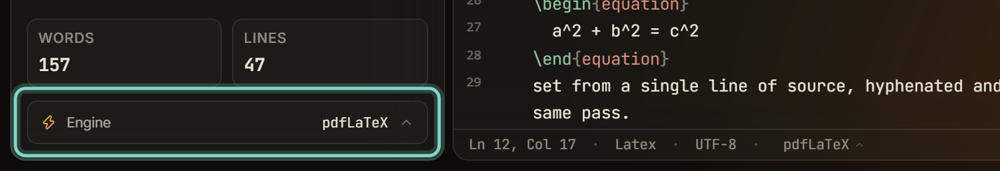

This page lists every setting in the build menu, which holds one LaTeX project's own engine, recipe, and compile options. For the compile loop, error reporting, and jumps between source and PDF, see [Compiling LaTeX and reading errors](/compiling/compiling-latex/). Each setting falls back to a global default until the project overrides it.

| Setting | Default | What it does |
| --- | --- | --- |
| **Engine** | The global **Default engine** setting | Selects the engine this project compiles with. |
| **Recipe** | **Latexmk (auto)** | Sets which programs run, and in what order. |
| **Shell-escape** | Off | Lets the document run external programs during a compile. |
| **SyncTeX** | On | Generates the sync data forward and inverse search need. |
| **Stop on first error** | The global setting, which ships on | Halts the compile at the first error. |
| **Auto-compile on save** | The global setting, which ships off | Recompiles the project after every save. |

The **Engine** pill in the sidebar opens the build menu, and so does the engine name in the status bar.



## Engine

The build menu picks a concrete engine for one project. The global **Default engine** setting chooses only between **System TeX** and **Tectonic**. See [Choosing a compile engine](/getting-started/compile-engines/).

| Engine | What it does |
| --- | --- |
| **pdfLaTeX** | What a project without an override compiles with when the global setting is **System TeX**. |
| **XeLaTeX** | Handles documents that use system fonts through `fontspec`. Selectable here, never in **Settings**. |
| **LuaLaTeX** | The Lua-extended engine, also `fontspec`-capable. Selectable here, never in **Settings**. |
| **Tectonic** | The bundled, self-contained engine. It needs no TeX distribution and downloads packages on demand. |

With the default recipe, the three **System TeX** engines run through `latexmk` from your TeX distribution, with `-pdf`, `-xelatex`, or `-lualatex`. If `latexmk` is missing or fails, Typeward calls the engine binary (`pdflatex`, `xelatex`, or `lualatex`) directly and marks the switch in the log.

The engine also decides whether chapter drafts are available. **Draft this chapter** needs one of the **System TeX** engines. With **Tectonic** selected it refuses with `chapter drafts need a latexmk/pdflatex engine (Tectonic has no \includeonly fast path)`. See [Chapter drafts](/compiling/chapter-drafts/).

## Recipe

For the **System TeX** engines, the recipe decides which programs run, and in what order.

| Recipe | What runs |
| --- | --- |
| **Latexmk (auto)** | The default. `latexmk` handles bibliography and rerun passes automatically. |
| **Engine only (×2)** | Two engine passes, no bibliography. |
| **Engine + BibTeX** | Engine, `bibtex`, then two more engine passes, for classic `.bib` workflows. |
| **Engine + Biber** | Engine, `biber`, then two more engine passes, for `biblatex` documents. |

The three recipes whose names start with **Engine** bypass `latexmk` entirely, which helps on MiKTeX installs where the Perl dependency of `latexmk` is broken. If `bibtex` or `biber` is missing from `PATH`, the compile still finishes, and the log records that citations were left unresolved.

**Tectonic** runs its own bibliography passes, so the menu replaces this section with a line saying the recipe is ignored.

## Shell-escape

Shell-escape is off until you turn it on. It lets the document run external programs during a compile, which packages such as `minted` need. That same power lets a document run any program at all, so Typeward gates it twice:

- The **Shell-escape** toggle in the build menu carries the hint **Lets the document run programs (needs approval)**.
- Turning that toggle on raises a native confirmation dialog, which grants or refuses shell-escape for this project on this machine.

Typeward stores the answer in its app data on that machine, never in the project folder, so a project you cloned or downloaded cannot arrive with the permission already granted. See [Data locations](/reference/data-locations/).

Decline the dialog and compiles run without the flag. A stored refusal shows as **Blocked on this machine. Re-approve…** in the menu, and selecting it clears the block and asks again.

With **Tectonic**, the same grant is what switches the engine out of its hardened mode. Without the grant Tectonic compiles with `--untrusted`; with it Typeward passes `-Z shell-escape` instead.

:::danger[Approved programs run with your permissions]
Approve shell-escape only for projects whose sources you trust. Every program the document starts runs under your user account.
:::

## SyncTeX

**SyncTeX** is on by default and carries the hint **Forward/inverse search between source and PDF**. It generates the sync data that forward and inverse search need. With it off, jumping between source and PDF stops working.

## Stop on first error

**Stop on first error** follows the global setting, which ships on, so the compile halts at the first error. Turned off, LaTeX pushes past errors and collects every diagnostic in one pass, usually producing a best-effort PDF. **Tectonic** always halts at the first error, whatever this switch says.

## Auto-compile on save

**Auto-compile on save** follows the global setting, which ships off. On, every save recompiles the project. Autosave rides the same save path, so an autosave also recompiles.

:::note[The PDF toolbar changes the global values, not this project's]
The **Compile options** popover in the PDF toolbar edits the global **Auto-compile on save** and **Stop on first error** settings. The per-project values live in the build menu and in the **Build** section of **Project settings…**.
:::

## Clean auxiliary files

**Clean auxiliary files** in the menu's footer deletes the regenerable artifacts and keeps the PDF. It removes the main file's whole set at both locations a PDF can land in, plus every `.aux` in the project tree. A multi-file document leaves one `.aux` per included chapter. The report is either **Nothing to remove. The build directory was already clean.** or the number of files removed.

The classic case is a build wedged by a stale `.aux` file, usually after a change to the bibliography setup. Every compile then fails at `\begin{document}` no matter what you edit. The log parser recognizes that state and raises a warning that reads **Use Engine → Clean auxiliary files, then compile again.**

## Main file

**Project settings…** in the menu's footer opens the project settings dialog. Its **Main file** section lists the project's `.tex` files, described as **The entry file the compiler builds.** The selected file is the compile root. In a multi-file project, where chapters arrive through `\input` or `\include`, the main file is the file that contains `\begin{document}`.

## PDF output location

Typeward compiles in place, exactly as running the tools yourself would, and creates no separate build directory. The two engine families disagree on where the PDF goes.

- **System TeX engines** (`latexmk`, `pdflatex`, `xelatex`, `lualatex`) run with the project root as their working directory and pass no output-directory flag. The PDF is `<main file stem>.pdf` in the project root, so a main file at `chapters/thesis.tex` produces `thesis.pdf` at the top of the project, not `chapters/thesis.pdf`.
- **Tectonic** writes beside its input, so `chapters/thesis.tex` produces `chapters/thesis.pdf`.

The two locations coincide only when the main file sits at the top level, which is the common case. Auxiliary files (`.aux`, `.log`, `.bbl`, `.synctex.gz`, and the rest) follow the same rule as the PDF for whichever engine produced them.

## Strictly offline Tectonic builds

Tectonic reaches the network for packages it has not cached yet. For a build that can never do that, Typeward reads a `compile.strictOffline` key from its `settings.json`, which adds Tectonic's `--only-cached` flag.

```json
{
  "compile": {
    "strictOffline": true
  }
}
```

**Settings** has no control for this key, so it takes a hand edit of `settings.json`. See [Data locations](/reference/data-locations/). Typeward preserves the key when it saves anything else from **Settings**, and reads the value at the start of each compile.

The key ships off because `--only-cached` turns a first compile into a failure rather than a download while the cache is cold. A normal online build warms the cache. The key has no effect on the **System TeX** engines, which never fetch anything.

## How these values are stored

Typeward stores every value in the build menu per project, inside the project's `.typeward` folder, in `project.json` under `build`. A value set here wins over the matching global default under **Settings → Editor → Compilation**, and an unset value follows that default. **Reset to global defaults** at the bottom of the menu clears every override at once, which returns the project to the global settings.

## See also

- [Compiling LaTeX and reading errors](/compiling/compiling-latex/)
- [Choosing a compile engine](/getting-started/compile-engines/)
- [Chapter drafts](/compiling/chapter-drafts/)
- [Data locations, credentials, and uninstall](/reference/data-locations/)
