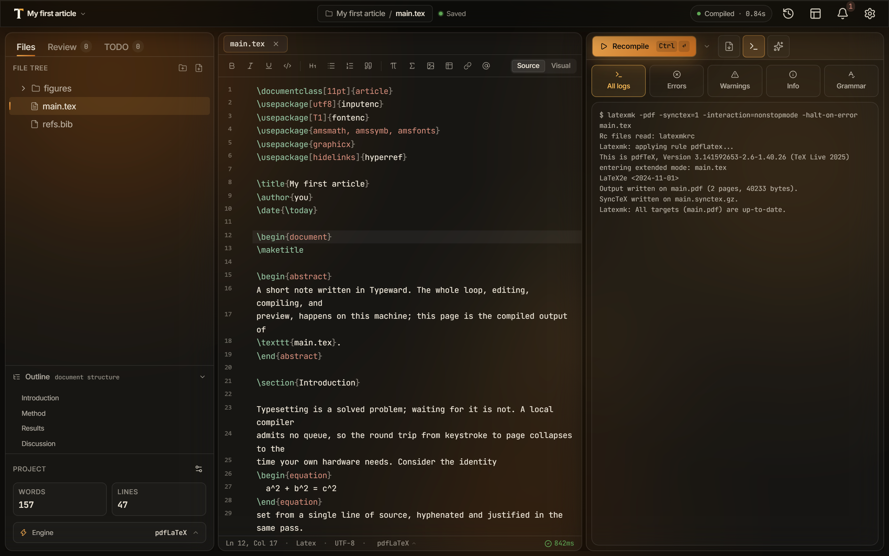

import Clip from '../../../components/Clip.astro';

This guide shows you how to compile a LaTeX project, read what the logs panel reports, and jump between the source pane and the compiled PDF. For Typst projects, see [Typst projects](/getting-started/typst/).

Before your first compile, pick the engine the project builds with. See [Choosing a compile engine](/getting-started/compile-engines/).

## Compile your project

Four routes start a compile.

- Press `Ctrl+Enter` (`Cmd+Enter` on macOS).
- Press `Ctrl+S` (`Cmd+S` on macOS). The **Save and compile** command writes every unsaved file to disk and then always compiles.
- Select **Compile** in the preview pane toolbar. The button reads **Recompile** once a PDF exists.
- Run **Compile LaTeX** from the command palette, `Ctrl+K` (`Cmd+K` on macOS).

Every compile saves all unsaved files first, so a multi-file project always compiles what you see on screen. Only one build runs at a time.

<Clip
  name="compile-flow"
  label="Recording of a sentence typed into main.tex, then Ctrl+S: the compile runs and the PDF appears in the preview pane."
/>

## Watch or stop a running compile

While a build runs, the primary button in the preview pane toolbar turns red and reads **Stop**, and an elapsed timer beside it counts minutes and seconds. Select **Stop** to abandon the build. Typeward kills the whole build, including any process it started, and the preview pane returns to idle with a **Compile stopped** notice.

A stopped build is not a failure. Typeward produces no diagnostics for it, and the logs panel does not open itself.

The **All logs** tab streams the compiler's output as it arrives and follows the end of the stream, so a slow build stays readable while it happens. The view keeps the last 5000 lines and notes how many earlier ones it dropped. The full text is still in the finished log.

Every compiler process a build starts is bounded at 10 minutes, so a recipe that runs several passes gets that ceiling per pass. On the deadline Typeward stops the whole build, writes a timeout line naming the tool that ran out of time into the log, and surfaces that line as an error card. A timeout never falls back to a different engine binary. See [Troubleshooting](/troubleshooting/troubleshooting/) for the exact line and what causes it.

When a build leaves the PDF unchanged, Typeward skips reloading the preview pane entirely, so a recompile that changes nothing does not disturb the page you were reading.

## Read the logs panel

Compile output opens as a **Logs** tab next to the preview pane by default. The **Layout** menu can move it to a **Bottom drawer** below the source pane instead. The panel has five tabs, and each one except **All logs** carries a counter.

- **All logs** holds the raw output of the compile, and it is the ground truth when something behaves unexpectedly. On the **System TeX** engines (**pdfLaTeX**, **XeLaTeX**, **LuaLaTeX**), Typeward echoes each command it ran ahead of that command's output as `$ latexmk ...`. A fall back from latexmk to the engine binary is marked in the log where it happens. Tectonic prints only its own output, with no command line.
- **Errors**, **Warnings**, and **Info** hold the diagnostics parsed out of that log, one clickable card per issue, with overfull and underfull boxes under **Info**. Each card names the file and line it was attributed to, and selecting it opens that file at that line. Diagnostics the parser cannot pin to one of your files are anchored at the entry file instead.
- **Grammar** holds Harper's spelling and style problems for the files you have opened, with a total count and per-family filter chips. It stays empty until you turn grammar checking on. See [Grammar and spell checking](/editor/grammar-checking/).

Two things thin the card list. Diagnostics raised by a package or class file have no jump target, so they sit behind a **Show N from packages and classes** button. A very noisy build stops at 400 cards and closes the list with a note pointing at the full log.

## Change how a compile behaves

Two settings under **Settings → Editor → Compilation** change the compile loop for every project.

- **Auto-compile on save** is off by default. Turn it on and an autosave also triggers a recompile, so the preview pane tracks your edits with no keystroke at all. `Ctrl+S` compiles either way.
- **Stop on first error** is on by default. The compile halts at the first error instead of pushing on to produce a partial PDF. Turn it off to get every diagnostic, and a best-effort PDF, from a single pass. Tectonic always halts at the first error, whatever this setting says.

The caret beside the compile button opens the **Compile options** popover. It carries the same two switches, labeled **Compile on save** and **Stop on first error** there, plus a read-only line naming the global engine. Those switches edit the global settings, and the engine line does not reflect a per-project override. The status bar names the engine the project actually compiles with.

To override either switch for a single project, along with the engine and the recipe, use the build menu. See [Per-project build configuration](/compiling/build-configuration/).

## Draft a single chapter

A full build of a thesis or a book is slow. **Draft this chapter** retypesets only the chapter you are editing. Typeward reuses the previous build's auxiliary files, so cross-references and page numbers stay correct while the redraw takes seconds.

1. Run a normal compile once, so a complete set of auxiliary files exists to reuse.
2. In the command palette, run **Draft this chapter**, listed in the **Build** group.

The command has no keyboard shortcut and needs one of the **System TeX** engines. The PDF it produces holds that one chapter, so run a normal compile before you export. See [Chapter drafts](/compiling/chapter-drafts/).

## Jump between the source pane and the PDF

SyncTeX links each source line to the place in the PDF it produced, and Typeward uses it in both directions.

- **Forward, source to PDF**: press `Ctrl+J` (`Cmd+J` on macOS). The preview pane scrolls to the part of the PDF produced by the line under your cursor and marks it with a brief highlight.
- **Inverse, PDF to source**: double-click anywhere on a PDF page. The source pane opens the right file and moves the cursor to the matching line. Shift+click works too.

SyncTeX also holds your place across recompiles. When a build starts, Typeward works out which source line is sitting at the top of the preview pane. Once the new PDF has loaded, Typeward scrolls so that same line is back near the top. A chapter that gained two pages earlier in the document no longer pushes your reading position off screen. See [PDF preview](/preview/pdf-preview/).

SyncTeX needs the `synctex` command-line tool, which ships with TeX Live, MacTeX, and MiKTeX. If jumping does nothing, you most likely have no TeX distribution installed. Compiling only with the bundled Tectonic engine is the common case.

Nothing reports an error when `synctex` is missing. The jumps and the scroll anchor stop working, and the preview pane falls back to restoring the raw scroll offset. Typst produces no SyncTeX data at all, so neither direction is available in a Typst project.

## Check that it worked

After a successful compile, the preview pane shows the new PDF and the compile indicator in the status bar reads the build time next to a check. A cross marks a failed build, and a spinner marks one still running. Select the indicator to recompile after a good build, or to reveal the **Errors** tab after a bad one.

## If it does not work

A failed compile expands the logs panel on the **Errors** tab by itself. Some layouts leave it nowhere to paint: the editor-only layout and a detached preview window remove the pane that hosts the **In preview panel** logs, and focus mode hides the **Bottom drawer**. The failure then arrives as a **Compile failed** toast with a **View errors** action, which brings the panel back and opens that tab.

LaTeX errors cascade, so fix the first one and compile again before working through the rest.

1. In the **Errors** tab, read the top card, then select it to open the file at the line it names.
2. In the **All logs** tab, find the first line starting with an exclamation mark (`!`) when the card alone does not explain the failure.
3. Correct the source, then press `Ctrl+S` to compile again.

Three common errors come from the LaTeX in your own source.

| Error | What it means | What to do |
| --- | --- | --- |
| `Undefined control sequence` | LaTeX hit a command it does not know. | Correct the spelling of the command, or load the package that defines it with `\usepackage{...}`. |
| `Missing $ inserted` | A math-only character such as `_` or `^` sits outside math mode. | Wrap the expression in `$...$`, or escape the character. |
| `Environment 'xyz' undefined` | The package that defines the environment in `\begin{xyz}` is not loaded. | Add the `\usepackage` line that loads it. |

Other failures come from your setup rather than from your source:

- No LaTeX engine on the `PATH`.
- A package your TeX distribution does not have.
- Auxiliary files wedged by a change to the bibliography setup.

Each of those raises its own log line and its own fix. See [Troubleshooting](/troubleshooting/troubleshooting/).

## Next steps

- [Per-project build configuration](/compiling/build-configuration/): give one project its own engine, recipe, and compile switches.
- [PDF preview](/preview/pdf-preview/): the preview toolbar, zoom, page navigation, and the detached preview window.
- [Exporting your work](/projects/exports/): send the compiled PDF out, or export to Word or HTML.
