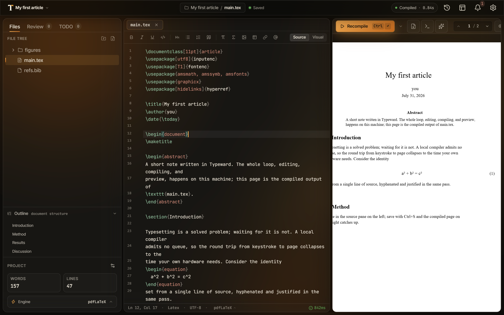

The editor shows one project: the sidebar lists its files, the source pane holds the file you are editing, and the preview pane renders the compiled PDF. Selecting a project in the [projects library](/projects/library/) opens the editor on that project, and the project pill in the top bar switches to another one. This page names every region once, and the rest of these docs reuse those names.

## Top bar

The project pill carries the project name, and selecting it opens the **Recent** list of your other projects and **Back to all projects**. The breadcrumb names the project, the folders, and the file, next to a pulse dot reading **Saved** or **Unsaved** for the active file. Typeward saves that file for you while **Autosave** is on. See [Autosave and crash recovery](/projects/autosave-recovery/).

The rest of the top bar holds these controls:

- The compile pill shows a status word (**Idle**, **Compiling…**, **Compiled**, or **Error**) and the last compile's duration in seconds. Select it to compile again, or to open the errors after a failure.
- The sync badge aggregates the sync state in projects backed by a WebDAV server, and is absent in every other project. See [Cloud sync with WebDAV](/projects/cloud-sync/).
- **Project history** opens the local version history popover. See [Version history](/projects/version-history/).
- **Layout** sets the pane arrangement and the position of the logs panel.
- **Notifications** opens a drawer. Compile, sync, and update messages arrive as toasts, and nothing routes into the drawer.
- **Settings**, or `Ctrl+,` (`Cmd+,` on macOS) from anywhere, opens **Settings**. **Settings → Editor** holds font size, line numbers, autosave, the **Keybindings** setting, and the compile defaults. See [Settings reference](/reference/settings/).

## Sidebar

The sidebar is tabbed. **Files**, **Review**, and **TODO** are always present, and **Refs** and **SCM** appear when they have something to show.

- **Files** is the file tree, headed **File tree** with **New folder** and **New file** buttons. Create, rename, move, and import files from this tab. See [Files and folders](/projects/files-and-folders/).
- **Refs** appears once a reference manager is configured, and lists your reference entries. See [How references work](/references/how-references-work/).
- **SCM** appears when the project folder is a git repository, and holds staging and commits. See [Git in Typeward](/projects/git/).
- **Review** and **TODO** carry live counters: open comment threads on **Review**, and scanned markers plus open TODO threads on **TODO**. See [Review comments and TODOs](/editor/review-comments/).

The sidebar footer holds a **Project settings** gear and live **Words** and **Lines** counts for the active file. In LaTeX projects it also carries an **Engine** pill naming the effective engine, for example **pdfLaTeX**. Selecting the pill opens the build menu. See [Per-project build configuration](/compiling/build-configuration/).

## Outline

The **Outline** section of the sidebar shows the active file's heading tree, and selecting an entry jumps the cursor there. The section collapses. A file with no headings reads **No headings in this file.**, and a file type with no heading structure, such as `.bib`, `.txt`, or `.json`, reads **Outline unavailable for this file type.** See [Search, replace, and navigation](/editor/search-and-navigation/).

## File tabs

Each open file gets a tab showing its project-relative path, a colored dot while the file has unsaved changes, and a close button. Right-clicking a tab offers **Close**, **Close others**, and **Close saved**.

`Ctrl+W` (`Cmd+W` on macOS) closes the active tab. `Ctrl+Tab` and `Ctrl+Shift+Tab` cycle through the open tabs, using the literal `Ctrl` key on every platform, including macOS. See [Keyboard shortcuts](/reference/keyboard-shortcuts/).

## Format toolbar

When the active file takes prose formatting (`.tex`, `.sty`, `.cls`, `.typ`, `.md`, and `.markdown` files, but not `.bib`), a format toolbar appears between the file tabs and the source pane. It carries style, structure, and insert groups, and for `.tex` files a **Source** and **Visual** switch at its end. See [Visual editing for LaTeX](/editor/visual-editing/).

## Source pane

The source pane is the text editor itself. Each part of it has its own guide:

- [Autocomplete, snippets, and formatting](/editor/autocomplete-and-snippets/): completion from the built-in project index and from the optional language servers, plus the insert templates behind the format toolbar.
- [Labels, references, and navigation](/editor/latex-navigation/): `Ctrl+click` (`Cmd+click` on macOS) or `F12` jumps from a `\ref` or `\cite` to its definition, plus hover previews, warnings for undefined and duplicate labels, and a project-wide label rename.
- [Search, replace, and navigation](/editor/search-and-navigation/): find and replace with `Ctrl+F` (`Cmd+F` on macOS), go to file with `Ctrl+P` (`Cmd+P` on macOS), the command palette with `Ctrl+K` (`Cmd+K` on macOS), and the **Outline**.
- [Grammar and spell checking](/editor/grammar-checking/): local Harper checks with one-click fixes, off until you turn them on.
- [Editor context menu](/editor/context-menu/): what right-clicking offers in the source pane.
- [Focus mode and keybindings](/editor/focus-and-vim/): `Ctrl+Shift+F` (`Cmd+Shift+F` on macOS) hides the surrounding regions, and the **Keybindings** setting switches the source pane to Vim or Emacs bindings.
- [Themes and appearance](/editor/themes/): how the editor looks.

## Preview pane

The preview pane renders the compiled PDF. Its toolbar holds the compile button, a compile-options caret, page navigation, and zoom. The button reads **Compile** until a PDF is showing, **Recompile** afterwards, and **Stop** while a cancelable compile runs. See [PDF preview](/preview/pdf-preview/).

Three more controls share that toolbar:

- The **Export** menu. See [Exporting your work](/projects/exports/).
- A **Logs** toggle, while the logs position is **In preview panel**.
- An **AI** toggle, once you switch the assistant on. See [AI assistant](/ai/overview/).

When the active tab is a Markdown file, the pane switches to a live [Markdown preview](/preview/markdown-preview/).

## Logs panel

The logs panel holds the compile output. The **Layout** menu gives it two positions. **In preview panel**, the default, makes it a tab next to the PDF, and **Bottom drawer** puts it in a strip under the source pane.

Either position carries five tabs, most of them badged with a count: **All logs**, **Errors**, **Warnings**, **Info**, and **Grammar**. The **Grammar** tab lists spelling and grammar findings while checking is on. Typeward parses errors and warnings from the raw log into clickable cards. See [Compiling LaTeX and reading errors](/compiling/compiling-latex/).

## Status bar

The status bar shows the cursor position, the active file's language, and its encoding. In LaTeX projects it also carries a pill naming the effective engine, for example **pdfLaTeX**, which opens the same build menu as the sidebar footer's **Engine** pill. Two indicators sit at its end:

- The grammar indicator counts current spelling and grammar problems, for example **3 problems**. It appears only while **Spell & grammar check** is on and something is flagged, and selecting it opens the **Grammar** logs tab. See [Grammar and spell checking](/editor/grammar-checking/).
- The compile indicator shows the last compile's duration in milliseconds. Select it to compile again, or to open the errors after a failure. See [Compiling LaTeX and reading errors](/compiling/compiling-latex/).

## Layout and what persists

The **Layout** button in the top bar sets the pane arrangement: **Split view** (the default), **Editor only**, **PDF only**, or **Detached preview**. **Detached preview** moves the PDF into its own window. See [PDF preview](/preview/pdf-preview/).

Typeward keeps the layout you set, with one exception:

| Part of the layout | How you change it | Across restarts |
| --- | --- | --- |
| Pane arrangement | **Layout → Pane layout** | Kept |
| Logs position | **Layout → Logs** | Kept |
| Sidebar width | Drag the sidebar's edge, between 200 and 400 px | Kept |
| Source and preview split | Drag the divider between the panes | Kept |
| **Detached preview** | **Layout → Pane layout** | The PDF returns to the preview pane |

Focus mode uses the same split between the source pane and the preview pane, so leaving focus mode puts them back exactly where they were.

## See also

- [Keyboard shortcuts](/reference/keyboard-shortcuts/)
- [Settings reference](/reference/settings/)
- [Glossary](/reference/glossary/)
