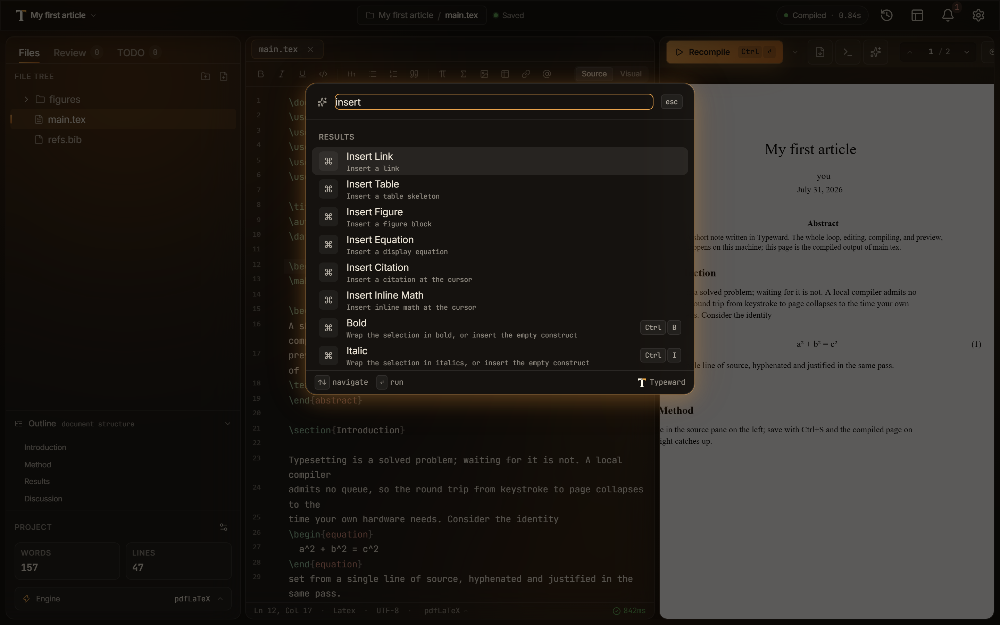

This guide shows you how to find text in a file, jump to a line or a file by name, and move around a project from the keyboard. To jump from a `\ref` or `\cite` key to its target, or to list every use of a label with **Find references**, see [Labels, references, and navigation](/editor/latex-navigation/).

Open a project in the editor before you start. Every route here except the command palette acts on an open project.

## Known limitations

- Search covers the open file only. Typeward has no project-wide text search.
- Typeward has no multiple cursors. The editor keeps one selection range, so `Ctrl+D` (`Cmd+D` on macOS) steps between occurrences rather than adding a cursor.
- The find bar in visual editing mode has no replace field and no regexp toggle.

## Find and replace in the open file

The search panel opens in the source pane and acts on the file in the active tab.

1. Press `Ctrl+F` (`Cmd+F` on macOS) to open the search panel.
2. Type your text in the **Find** field.
3. Press `F3` or `Ctrl+G` (`Cmd+G` on macOS) to step to the next match, or `Shift+F3` or `Ctrl+Shift+G` (`Cmd+Shift+G` on macOS) to step back.
4. Optional: Type the replacement in the **Replace** field.
5. Optional: Select **replace** or **replace all**.
6. Press `Escape` to close the panel.

The panel also carries the **match case**, **regexp**, and **by word** checkboxes, plus the **next**, **previous**, and **all** buttons.

:::tip
`Ctrl+D` selects the word under the cursor, and each further press moves the selection to the next occurrence of it.
:::

## Find text in visual editing mode

While [Visual editing for LaTeX](/editor/visual-editing/) renders a `.tex` file, `Ctrl+F` opens a compact find bar at the top of the source pane instead of the full panel.

1. Press `Ctrl+F` to open the find bar.
2. Type your text in the field whose placeholder reads **Find in document…**.
3. Press `Enter` to step to the next match, or `Shift+Enter` to step back.
4. Press `Escape` to close the bar.

The counter gives your position as `3 of 12`, and reads `0 results` when nothing matches. Selecting the `↑`, `↓`, and `✕` buttons does the same work, and their tooltips read **Previous (Shift+Enter)**, **Next (Enter)**, and **Close (Escape)**.

The bar searches the text you can see, case-insensitively and literally, so hidden markup never matches. Typeward counts every widget and every hidden run as a single space, and selects a match where it sits. To replace, to use regexp, or to search for commands, switch to **Source** mode.

## Go to a line or a matching bracket

1. Press `Ctrl+Alt+G` (`Cmd+Alt+G` on macOS) to open the **Go to line** prompt, prefilled with the current line number.
2. Type a destination and press `Enter`, or select **go**.

The prompt accepts four forms of destination.

| What you type | Where the cursor lands |
| --- | --- |
| `240` | Line 240 |
| `+10` or `-5` | Ten lines forward, or five lines back |
| `50%` | Halfway through the file |
| `120:8` | Line 120, column 8 |

To move the cursor to the bracket matching the one beside it, press `Ctrl+Shift+\` (`Cmd+Shift+\` on macOS).

## Open a file by name

1. Press `Ctrl+P` (`Cmd+P` on macOS) to run **Go to file**, which opens the command palette prefilled with the `file:` prefix.
2. Type part of a file name, and the matches rank by file name first and project-relative path second.
3. Press `Enter` to open the file in a new tab at line 1, or to activate its existing tab with the cursor and scroll position intact.

The `file:` prefix switches the palette to files-only matching, so typing `file:` yourself in the `Ctrl+K` (`Cmd+K` on macOS) palette does the same thing.

**Go to file** indexes text files only: `.tex`, `.typ`, `.md`, `.bib`, `.cls`, `.sty`, `.bst`, `.def`, `.ldf`, `.fd`, `.clo`, `.cnf`, `.txt`, `.csv`, `.json`, `.yaml`/`.yml`, and `.toml`. Indexing stops at 2000 files and 12 folder levels deep, and skips dot-directories such as `.git` and `.typeward`, along with `node_modules`, `build`, `out`, and `dist`.

Typeward caches the index and refreshes it when files change on disk. **Go to file** runs only while a project is open in the editor.

## Jump through the Outline

The **Outline** sits under the sidebar tabs, with the hint **document structure**, and shows the active file's heading structure as a tree.

- Select an entry to jump the cursor to that line.
- Select a chevron to fold or unfold a branch.
- Select the **Outline** header to collapse or expand the whole section.

Typeward highlights the heading your cursor sits under. Typeward refreshes the tree about half a second after you stop typing, and immediately when you switch files.

What counts as a heading depends on the file format.

| Format | Outline entries |
| --- | --- |
| LaTeX | `\part` through `\subparagraph`, including starred forms |
| Typst | `=` heading lines; the number of `=` characters sets the nesting level |
| Markdown | `#` headings (fenced code blocks are ignored) |

When a language server is running for the file, texlab for LaTeX or tinymist for Typst, the **Outline** uses its document symbols instead of the built-in parser. See [Autocomplete, snippets, and formatting](/editor/autocomplete-and-snippets/).

A file with no headings shows **No headings in this file.** File types with no heading structure, such as `.bib`, `.txt`, and `.json`, show **Outline unavailable for this file type.**

## Move between tabs

- `Ctrl+Tab` and `Ctrl+Shift+Tab` cycle forward and backward through the open tabs, wrapping at the ends. Both use the literal `Ctrl` key on macOS as well, because `Cmd+Tab` belongs to the operating system app switcher.
- `Ctrl+W` (`Cmd+W` on macOS) closes the active tab. Typeward asks first when that tab has unsaved changes, offering **Discard changes** or **Keep open**.
- `ArrowLeft`, `ArrowRight`, `Home`, and `End` move between tabs and activate them while the tab strip has focus.

Opening a file that already has a tab, from the file tree, **Go to file**, or the command palette, switches to that tab and keeps its cursor and scroll position.

## Search from the command palette

From anywhere in the app, `Ctrl+K` opens the command palette, whose field reads **Search commands, files, and projects…**.

- With an empty query, the palette lists your recently used commands, then up to five projects under **Recent projects**, then every available command under its own group.
- With a query, the palette fuzzy-matches commands, projects, and the current project's text files into one ranked **Results** list.

Selecting a project switches to it. Selecting a file opens or activates its tab, exactly as **Go to file** does. `Escape` closes the palette.

## Check that it worked

1. Press `Ctrl+P` to open **Go to file**.
2. Type three letters of a file name that has no tab open.
3. Press `Enter` to open the file in a new tab at line 1.

You should now see that file's heading structure in the **Outline**, with the heading holding your cursor highlighted.

## See also

- [Labels, references, and navigation](/editor/latex-navigation/)
- [Keyboard shortcuts](/reference/keyboard-shortcuts/)
- [Editor overview](/editor/overview/)
