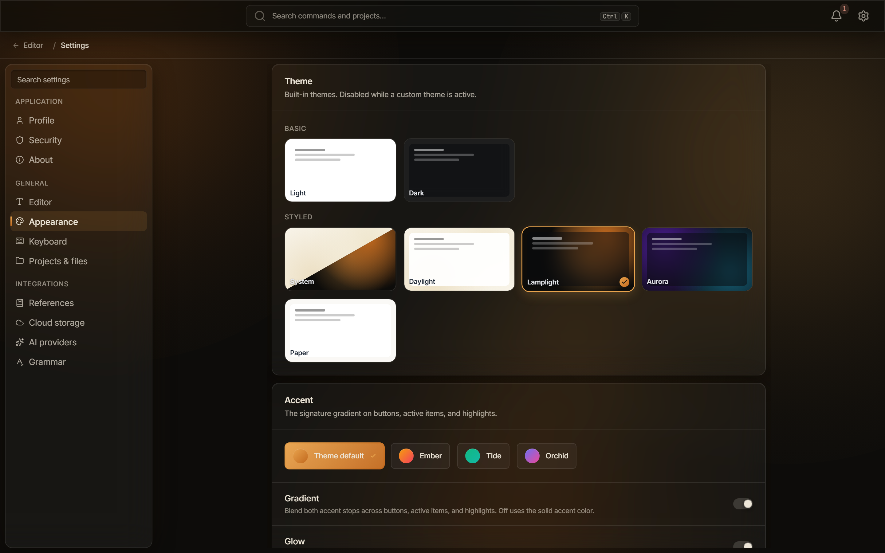

This guide shows you how to change Typeward's appearance: the theme, the accent color, the density and scale of the interface, and custom themes of your own. For every appearance setting listed with its default, see [Settings reference](/reference/settings/).

Open **Settings** with `Ctrl+,` (`Cmd+,` on macOS) and select **Appearance**. That screen holds every control in this guide.



## Pick a built-in theme

The **Theme** card holds six built-in themes in two groups, and the default is **Daylight**.

| Theme | Group | Light or dark |
| --- | --- | --- |
| **Light** | **Basic** | Light |
| **Dark** | **Basic** | Dark |
| **Daylight** | **Styled** | Light |
| **Lamplight** | **Styled** | Dark |
| **Aurora** | **Styled** | Dark |
| **Paper** | **Styled** | Light |

Select a tile to switch to that theme.

The **Styled** group also holds a **System** tile that follows your operating system's appearance. A light operating system resolves to **Daylight**, and a dark one to **Lamplight**. Typeward re-tints the moment the operating system switches, with no restart.

## Set the accent color

The **Accent** card offers four choices:

- **Theme default**: the active theme's native accent
- **Ember**: amber to rose
- **Tide**: emerald to teal
- **Orchid**: indigo to pink

Two toggles refine how Typeward uses the accent:

- **Gradient** (on by default): blends the accent's two color stops across buttons, active items, and highlights. With it off, Typeward uses a single solid accent color.
- **Glow** (on by default): puts a soft accent glow behind primary buttons and hovered cards. The row appears only while a **Styled** theme is active, and on the **Basic** themes glow is off regardless of the setting.

## Adjust density, scale, and motion

The **Density & motion** card holds four controls.

| Control | Default | What it does |
| --- | --- | --- |
| **UI density** | **Cozy** | Sets padding and row heights across the app. The other choices are **Compact** and **Comfortable**. |
| **Interface scale** | 100% | Scales text and controls together, from 90% to 150% in steps of 5. |
| **Animations** | On | Turns transitions, easings, and ambient motion on and off. |
| **Ambient lights** | On | Shows the soft radial light blobs behind the glass surfaces. |

Each of the four carries one condition:

- **UI density**: on a touch device, the first launch starts at **Comfortable** instead. Picking any density yourself opts that device out of the automatic choice.
- **Interface scale**: `Ctrl+=` and `Ctrl+-` (`Cmd+=` and `Cmd+-` on macOS) step this same setting from anywhere in the app, and `Ctrl+0` resets it to 100%. Those keys run the **Zoom In**, **Zoom Out**, and **Reset Zoom** commands. Typeward has no separate window zoom, and the scale you land on survives a restart. See [Keyboard shortcuts](/reference/keyboard-shortcuts/).
- **Animations**: when your system's Reduce Motion setting is on, animations stay off regardless of this toggle.
- **Ambient lights**: the row appears only while a **Styled** theme is active, since the **Basic** themes have no blobs to dim.

## Add a custom theme

A custom theme is one JSON file in the `themes/` folder of Typeward's app data folder, and it layers your own tokens over a built-in base. On Windows that folder is `%APPDATA%\com.typeward.app\themes`. See [Data locations, credentials, and uninstall](/reference/data-locations/).

The **Custom themes** card carries a master toggle, **Enable custom themes**, which is off by default.

1. On the **Custom themes** card, turn on **Enable custom themes**.
2. Select **Create sample** to write `harbor.json`, a complete dark theme on the **Lamplight** base that uses every available token.
3. Select **Open folder** to open the `themes/` folder in your file manager.
4. Copy `harbor.json` under a new file name and edit the copy.
5. Back in Typeward, select **Reload**.
6. Select the new theme's tile to activate it.

Selecting **Create sample** again never overwrites an existing `harbor.json`, so a copy you have edited is safe.

### Write the theme file

Each theme file holds three fields:

```json
{
  "name": "My theme",
  "base": "lamplight",
  "tokens": {
    "--token-name": "value"
  }
}
```

| Field | What it sets | Limits |
| --- | --- | --- |
| `name` | The name shown on the theme's tile | 1 to 64 characters |
| `base` | The built-in theme that supplies every token you do not override | `light`, `dark`, `daylight`, `lamplight`, `aurora`, or `paper` |
| `tokens` | The CSS custom properties this theme overrides | Up to 200 per file, keyed by `--` plus lowercase letters, digits, and hyphens |

Token values are capped at 256 characters and may not contain `;`, `{`, `}`, `<`, `>`, or a backslash (`\`). A theme file may be at most 64 KB. The file name becomes the theme's id, and may hold only letters, digits, `-`, and `_`. An invalid file is never silently skipped, because the **Custom themes** card shows a per-file warning instead.

### Reload after an edit

**Reload** re-scans the `themes/` folder. If the theme you are editing is active, Typeward re-skins live with no restart. Reloading is manual, since Typeward never watches the folder for changes. If the active theme's file disappears from the folder, Typeward warns you and falls back to the theme's base.

### Switch back to a built-in theme

Select the active tile again to return to the built-in themes. While a custom theme is active, the **Theme** and **Accent** pickers are dimmed and carry the note **Managed by your custom theme. Turn it off in Custom themes below to change these.**

## Copy settings and themes to another machine

Every setting in this guide is stored on the machine you set it on, in `settings.json` in Typeward's app data folder. Typeward also mirrors the theme and accent to a small browser-storage entry, so the launch splash paints in the right colors before the rest of the app loads.

Nothing syncs anywhere. Typeward has no account and no server, so a second machine starts on the defaults until you set it up as well. A custom theme is available only on the machine whose `themes/` folder holds its JSON file, so copy that file across yourself and select **Reload**.

## Check that it worked

The **Theme** picker marks the tile you selected, and the interface carries that theme's colors. A custom theme also appears as its own tile on the **Custom themes** card, labeled with the `name` from its file.

## If it does not work

When a custom theme does not appear or does not apply, work down this list.

1. Confirm **Enable custom themes** is on.
2. Confirm the file sits in the `themes/` folder and ends in `.json`.
3. Select **Reload**, because Typeward reads the folder only on demand and at startup.
4. Read the per-file warning on the **Custom themes** card, which names any file Typeward rejected.

## See also

- [Settings reference](/reference/settings/)
- [Keyboard shortcuts](/reference/keyboard-shortcuts/)
- [Data locations, credentials, and uninstall](/reference/data-locations/)
