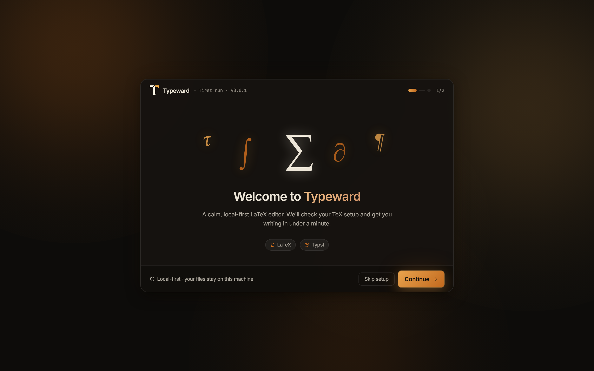
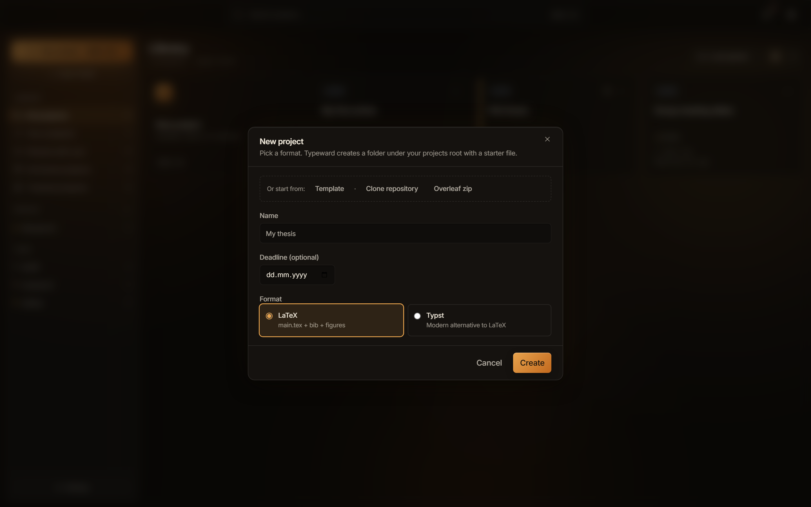

This tutorial takes you from a fresh install to a compiled PDF on screen. It assumes Typeward is installed and assumes no LaTeX experience. For a Typst project, see [Typst projects](/getting-started/typst/).

## Before you start

There is no account and no sign-in: every step in this tutorial happens on your machine, on ordinary files you can open in your file manager.

## Finish the first-run setup

The first launch opens a two-step setup wizard that checks your TeX setup and picks a compile engine.

1. On the welcome step, select **Continue**.
2. On the second step, wait for the check of your typesetting tools to finish, then select **Get started**.

You should now see the projects library, headed **Library**. Typeward has already set the engine from what the check found. It picks **System TeX** when a TeX distribution is on your `PATH`, and the bundled **Tectonic** engine when none is.

If instead the wizard never appears, Typeward has run before and the setup is already done. To confirm which engine it chose, see [Choosing a compile engine](/getting-started/compile-engines/).

:::tip[The wizard is optional]
**Skip setup** goes straight to the projects library, and the engine check still runs once, so the engine default is right either way. Everything the wizard sets can be changed later in **Settings**.
:::

## Create a project

Typeward creates the project folder for you, under your projects root.

1. In the projects library, select **New project**. The dialog reads "Pick a format. Typeward creates a folder under your projects root with a starter file."
2. In **Name**, type a name for your project, and leave **Deadline (optional)** empty.
3. Under **Format**, select **LaTeX**, described in the dialog as "main.tex + bib + figures".
4. Select **Create**.

You should now see `main.tex` open in the source pane, with your project's files under the **Files** tab in the sidebar. See [Editor overview](/editor/overview/).

Typeward created the folder under your projects root, `Documents/Typeward` by default, and named it after the project. If instead the folder name differs from the name you typed, Typeward replaced everything other than letters, digits, hyphens, and underscores with a hyphen.

Your `.tex` files, `.bib` files, and figures stay ordinary files that other tools can open, sync, or track with git, and compile output lands beside them. Typeward keeps its own bookkeeping in the project's `.typeward` folder. See [Files and folders](/projects/files-and-folders/).

## Compile the project

The starter `main.tex` carries a title block and one line of body text, and it compiles as it stands.

1. In the source pane, type a sentence of your own on a new line after `\maketitle`.
2. Press `Ctrl+S` (`Cmd+S` on macOS), which runs **Save and compile**.

While the compile runs, the preview toolbar button turns into a red **Stop** with an elapsed-time ticker beside it. The first compile with the bundled **Tectonic** engine downloads the packages your document needs, so it takes noticeably longer than the compiles after it.

You should now see your sentence in the PDF in the preview pane, and the preview toolbar button reads **Recompile**. If instead the compile fails, the logs panel holds the errors. See [Compiling LaTeX and reading errors](/compiling/compiling-latex/).

`Ctrl+S` saves every open file with unsaved changes and then compiles once, whatever the **Auto-compile on save** setting says.

Autosave is on by default, so Typeward writes your edits to disk after a short idle pause and you rarely need to save by hand. Crash-recovery snapshots catch edits that never reached disk. See [Autosave and crash recovery](/projects/autosave-recovery/).

## Next steps

- [Compiling LaTeX and reading errors](/compiling/compiling-latex/) covers the whole compile loop, the log tabs, and how to read a LaTeX error.
- [Choosing a compile engine](/getting-started/compile-engines/) explains what **System TeX** and the bundled **Tectonic** engine each give you.
- [LaTeX basics in Typeward](/getting-started/latex-basics/) tours LaTeX itself, from sections to cross-references.
- [Project templates](/projects/templates/) starts a project from a document class and a title block instead of a bare starter file.
- [Importing from Overleaf](/getting-started/import-from-overleaf/) moves an Overleaf project in with a zip export or the git bridge.
- [Git in Typeward](/projects/git/) clones a repository into a new project, then stages, commits, and pushes from inside the app.
