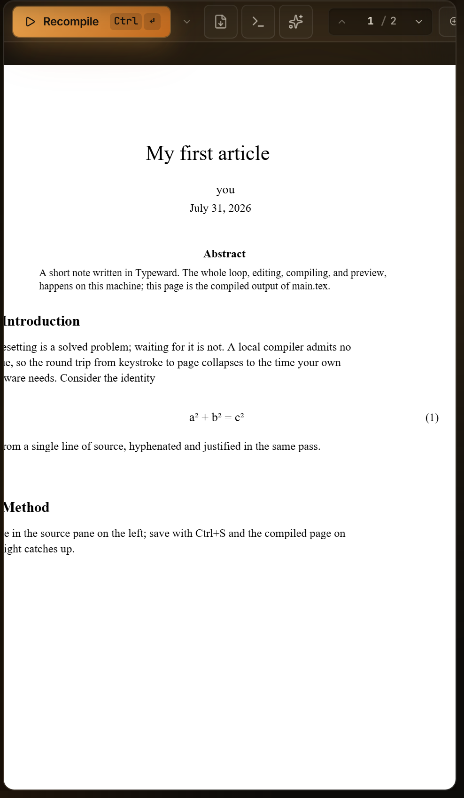

The preview pane shows the compiled PDF with a real text layer, so you can select and copy text straight off the page. The **Layout** button in the top bar sets where the pane lives. **Split view**, the default, keeps it beside the source pane, **PDF only** gives it the whole window, and **Detached preview** moves it into a window of its own. Opening a Markdown file swaps the pane to the [Markdown preview](/preview/markdown-preview/) for as long as that tab is active.

## Known limitations

- The preview pane has no text search. `Ctrl+F` (`Cmd+F` on macOS) belongs to the source pane and does nothing while the focus sits in the preview. The pages carry a real text layer, so you can select and copy from them, but nothing searches across them. To search the compiled document, export the PDF and open it in a PDF reader. See [Search, replace, and navigation](/editor/search-and-navigation/).
- Typeward has no print command, neither in the preview toolbar nor in the menu bar. Select **Export → Export PDF** in the preview toolbar, then print from your PDF reader. See [Exporting your work](/projects/exports/).

## Preview toolbar

The toolbar runs left to right:

- The primary compile button, with an elapsed-time ticker beside it while a build runs.
- A caret that opens the **Compile options** popover.
- The **Export** menu. See [Exporting your work](/projects/exports/).
- A **Logs** toggle, present only while the logs panel sits **In preview panel**. See [Compiling LaTeX and reading errors](/compiling/compiling-latex/).
- An **AI** toggle, which swaps the pane to the assistant chat and carries a dot while a reply streams in. The assistant is off until you turn it on, and the toggle is absent until then. See [AI assistant](/ai/overview/).
- The PDF filename.
- Page navigation, and then the **Zoom** dropdown as the last control.

## Compile button

The button reads **Compile** until a PDF exists and **Recompile** afterwards. While a build runs it turns into a red **Stop** button. Selecting **Stop** kills the build, and the pane returns to idle with a **Compile stopped** notice rather than an error.

`Ctrl+Enter` (`Cmd+Enter` on macOS) compiles from the keyboard, and `Ctrl+S` (`Cmd+S` on macOS) saves every file with unsaved changes and then compiles once. See [Compiling LaTeX and reading errors](/compiling/compiling-latex/).

## Compile options

The caret opens a popover with **Compile on save** and **Stop on first error** switches, which edit the global settings. The popover also carries a read-only line naming the global engine, reading **Engine: System TeX** or **Engine: Tectonic**. That line can also read **TeX Live (WASM)**, the engine only mobile builds use, and Typeward ships no mobile build.

The engine a project actually compiles with is the one named in the status bar, where a per-project override wins. See [Per-project build configuration](/compiling/build-configuration/).

## Page navigation

Chevrons step to the previous and next page. The current-page box is editable: type a page number and press Enter, or move the focus out of the box, to jump there. Typeward clamps out-of-range values to the document.

## Zoom

Three controls set the zoom level.

| Control | What it does |
| --- | --- |
| The **Zoom** dropdown | Offers **Fit width** and **Fit page**, then the presets 50, 75, 100, 125, 150, and 200% |
| `Ctrl` and the mouse wheel (`Cmd` and the wheel on macOS), or a trackpad pinch | Zooms between 25 and 400%, anchored at the pointer |
| **Settings → Editor → PDF preview** | The **Default zoom** row sets the zoom the preview opens at: 80, 90, 100, 110, 125, or 150%, and 110% by default |

Typeward recomputes **Fit width** and **Fit page** whenever you resize the pane.

## Ribbons and the empty pane

When you open a project, Typeward looks for the PDF a previous build left on disk and seeds the preview from it. You therefore start with pages instead of an empty pane, and a ribbon says where those pages came from.

| Situation | What the pane shows |
| --- | --- |
| A previous build left a PDF on disk | Those pages, under an accent-tinted **From last build. Nothing compiled yet this session** ribbon with a **Compile** link |
| A compile failed while an earlier PDF was on screen | The earlier pages, under a warning-tinted **Preview is stale. Showing the last successful compile** ribbon with a **View errors** link into the logs panel |
| No build has produced a PDF | A **Compile to render PDF** button instead of pages |

A preview restored from disk carries no build duration, and the **Errors** tab reads **Showing the last build**, adding that compiling refreshes the preview and surfaces diagnostics.

## Rendered pages

Pages render as you scroll them into view, and each one carries a `p. 3` margin label. A footer marks the end of the preview with the total page count.

**Settings → Editor → PDF preview** also holds **Invert on dark themes**, off by default, which flips the white page to dark for night reading. It takes effect only while a dark theme is active, and under a light theme the pages render normally.

## Comments and TODOs

Select text on a page and a floating chip offers **Comment** and **TODO**. Choosing one opens a compose card where you write the note and select **Add comment** or **Add TODO**.

Typeward paints open threads onto the pages as soft highlight bands, accent-tinted for comments and warning-tinted for TODOs, and re-places them after every recompile. Select a band to open its thread. See [Review comments and TODOs](/editor/review-comments/).

## Forward and inverse search

- `Ctrl+J` (`Cmd+J` on macOS) scrolls the preview to the output of the line under your cursor and pulses a brief highlight. That direction is forward search.
- Double-click a PDF page, or `Shift`+click, to jump the source pane to the matching file and line. Double-clicking a word also selects that word in the source pane. That direction is inverse search.

Both directions need SyncTeX data and the `synctex` command-line tool that ships with a TeX distribution. When the tool is missing, the jumps quietly do nothing rather than reporting an error. Typst produces no SyncTeX data at all, so neither direction works in a Typst project. See [Compiling LaTeX and reading errors](/compiling/compiling-latex/).

## Scroll position across recompiles

A successful compile swaps the new PDF in without disturbing you. Rendering is double-buffered, so the old pages stay visible until the new ones are drawn and no white flash appears, and your zoom level carries over. A recompile that leaves the PDF untouched on disk (latexmk deciding nothing changed) skips the reload entirely.

Typeward restores your scroll position in two steps. When the compile starts, it inverse-searches the top of the current viewport against the PDF still on screen and records the source file and line you were reading. Once the new PDF loads, the raw scroll offset goes back first. Typeward then refines the view so that same source line sits near the top of the viewport. Your reading position therefore survives an edit that adds or removes pages earlier in the document.

That refinement needs SyncTeX. Where SyncTeX is unavailable, such as a Tectonic-only install or a Typst project, the raw scroll offset restore is the silent fallback. The position can then drift when the page count changes.

## Detached preview window

The **Layout** button in the top bar (a grid icon) offers **Pane layout → Detached preview**. It opens the PDF in its own window and collapses the in-app pane, so the source pane takes the full width. That helps on a second monitor.

The detached window is PDF-only, with no **Export** menu, no **Logs** or **AI** toggles, and no **Stop** button. It keeps **Recompile**, page navigation, zoom, double-click inverse search, forward-search targets, and the review and TODO highlight bands with their selection chip. Every action relays back to the main window, which stays the single source of truth. The detached window also follows the main window's theme and accent.

To return to the split view, select the floating **Reattach** pill or close the window. Choosing any in-pane layout from the **Layout** menu while detached closes the window too. Detached preview is not offered on tablet-sized screens.

## See also

- [Editor overview](/editor/overview/)
- [Compiling LaTeX and reading errors](/compiling/compiling-latex/)
- [Per-project build configuration](/compiling/build-configuration/)
- [Markdown preview](/preview/markdown-preview/)
- [Exporting your work](/projects/exports/)
