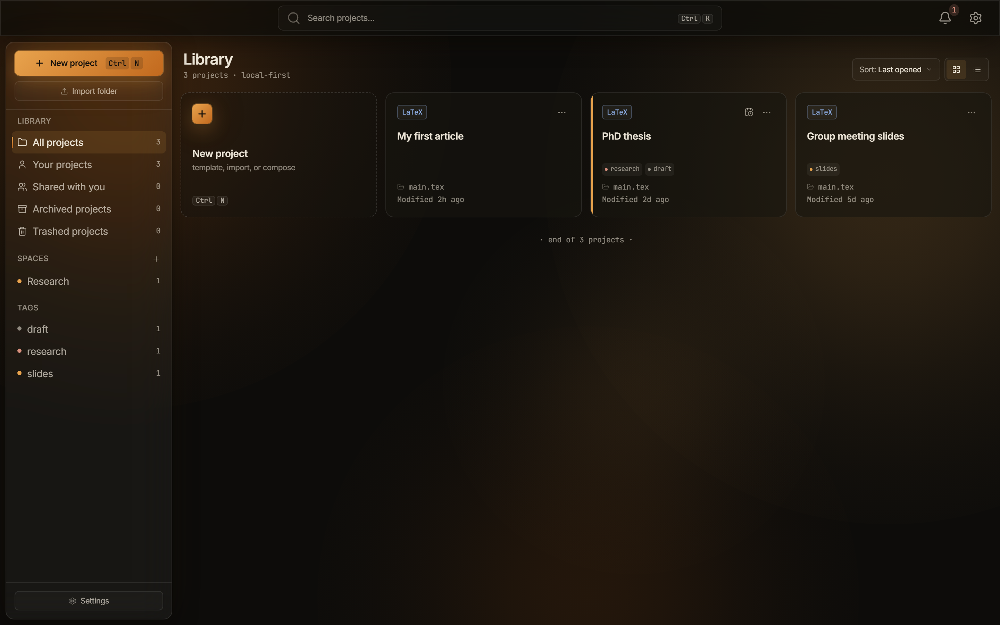

The projects library lists every project in your projects root, and it is where you create, import, tag, archive, and trash them. It is the screen you see whenever no project is open, and **Back to all projects** in the editor's project pill returns you to it. The heading reads **Library**, and the line under it counts what you have: "12 projects · local-first".

## Cards and list views

The **Cards** and **List** buttons switch the library between a grid of cards, which is the default, and a compact list. Both views lead with a **New project** tile, except in the trash.

A card carries the project's format chip (**LaTeX** or **Typst**), up to three tag chips with a `+N` overflow marker, the root file name, and a relative **Modified** time. Holding the pointer over a card shows the full **Created**, **Modified**, and **Last opened** stamps, prefixed with the space the project belongs to.

Three more markers appear when they apply:

- A cloud icon marks a project bound to a WebDAV server, with the tooltip "Synced · webdav". See [Cloud sync with WebDAV](/projects/cloud-sync/).
- A branch icon marks a project that is a git repository, with the tooltip `Git repository · <branch>`. See [Git in Typeward](/projects/git/).
- An **Archived** chip marks an archived project.

Typeward reads the created and modified times from disk every time the library loads, rather than storing them in the project file. They stay honest when you touch a folder outside Typeward. **Modified** is the newer of the project folder and the root file.

## Search and sort

The search field in the top bar, placeholder **Search projects…**, filters case-insensitively across project names, root file names, and tags. `Escape` clears it.

The **Sort:** dropdown holds seven orders: **Last opened**, **Name (A–Z)**, **Name (Z–A)**, **Date created**, **Last modified**, **Deadline**, and **Format**. **Last opened** is the default, and projects you have never opened sink to the bottom of it. **Deadline** puts the soonest first and leaves undated projects last.

When a filter or a search leaves nothing to show, the library reads **No projects match** and offers a **Clear filters** button.

## Library sidebar

The sidebar on the projects screen filters the library. It opens with the **New project** and **Import folder** buttons, and it ends with a **Settings** button. Under **Library**, five rows carry live counts.

| Row | What it lists |
| --- | --- |
| **All projects** | Every project that is neither archived nor trashed. |
| **Your projects** | The same projects as **All projects**. |
| **Shared with you** | Nothing. Its count stays 0. |
| **Archived projects** | Only archived projects, which are hidden from every other view. |
| **Trashed projects** | Only trashed projects, likewise hidden from every other view. |

Typeward has no sharing and no collaboration, so every project is yours and **Shared with you** stays empty. Its view reads "Nothing shared with you yet", followed by "Sharing and collaboration are coming soon." A project reaches another machine through a WebDAV server or a git remote instead.

Two more sections sit under those rows:

- **Spaces** are your own groups, for example *Thesis* or *Teaching*, each with a name and a tint color. Add one with the **+** button (**New space**), and edit or delete one from the row's **...** menu. Deleting a space never touches its projects, and the filter resets to **All projects**. Until you make one, the section reads "No spaces yet. Add one with +."
- **Tags** lists every tag used on a project that is neither archived nor trashed, most-used first, and selecting one filters the library. The empty hint reads "Tags you add to projects appear here."

## New project and Import folder

Two buttons at the top of the sidebar bring a project into the library.

- **New project**, `Ctrl+N` (`Cmd+N` on macOS), opens the new-project dialog, and the shortcut works from anywhere in the app, including the command palette. The dialog also holds the **Template**, **Clone repository**, and **Overleaf zip** starting points. See [Your first project](/getting-started/first-project/) and [Project templates](/projects/templates/).
- **Import folder** turns a folder that already exists, such as a manually copied repository or an unzipped download, into a Typeward project. Typeward writes a `.typeward/project.json` file into the folder and names the project after it. A folder that already carries that file is read as-is. See [Files and folders](/projects/files-and-folders/).

Import picks the root file from the folder's top level, in this order: `main.tex`, then the alphabetically first `.tex` file, then the alphabetically first `.typ` file. Subfolders are never searched. The winner also sets the project format, so a folder of Typst sources imports as a Typst project. If the top level holds no `.tex` and no `.typ` file, the import fails.

Import works only for folders inside your projects root. Anywhere else, the app tells you so: "Import only works for folders inside your projects root (`<root>`). Move the folder there first, or use Clone / Overleaf import from New project." On success the project opens in the editor. For the zip and git-bridge paths, see [Importing from Overleaf](/getting-started/import-from-overleaf/).

## Tags and deadlines

**Edit tags…** in a project's context menu opens the tag editor, headed **Tags** with the project name. It holds removable chips, an **Add a tag…** field where `Enter` commits, and suggestions drawn from the tags on your other projects. A project holds up to 32 tags of up to 48 characters each, and duplicates that differ only in case collapse into one.

Each project carries at most one deadline, a date with no time. Set it in the **Deadline (optional)** field when you create the project, or later from the calendar button on the card or row. That button stays hidden until you point at a project that has no deadline. The popover holds a date field and a **Clear** button.

An overdue deadline shows in the error color, and a deadline due within seven days shows in the warning color. Sorting by **Deadline** brings the next thing due to the top of the library.

## Project context menu

Right-click a card or a row, or select its **...** button, to open the project context menu.

| Item | What it does |
| --- | --- |
| **Open** | Opens the project in the editor. |
| **Move to space** | Assigns the project to one of your spaces, or to **None**. |
| **Edit tags…** | Opens the tag editor. |
| **Rename…** | Changes the display name only. The folder on disk keeps its name and path. |
| **Duplicate** | Copies the project into a new folder under your projects root, named `<name> copy` by default. |
| **Archive** / **Unarchive** | Hides the project from every view except **Archived projects**, and marks it with an **Archived** chip. |
| **Move to trash** | Flags the project as trashed and hides it from every other view. |

A trashed project's menu is different: it offers **Restore** and **Delete permanently…**.

A duplicate carries over the tags, space, deadline, and build settings, and it starts unarchived and never-opened. It does not carry the git or cloud binding, so the copy is a plain local folder. Typeward skips `.git`, `.svn`, `.hg`, and `node_modules`, and of the project's `.typeward` folder only `citations/` travels, so snapshots, review threads, and build output stay behind.

## Trash and permanent delete

**Move to trash** sets a flag in the project's metadata and leaves the folder on disk untouched. Trashed projects appear dimmed under **Trashed projects** and cannot be opened. Selecting one prompts **Project is in the trash** with a **Restore & open** button, and the **Moved to trash** toast carries an **Undo** action. An empty trash reads "Trash is empty", followed by "Projects you move to the trash can be restored or deleted permanently."

**Delete permanently…** is offered only on already-trashed projects. After a confirmation, Typeward moves the folder to the Recycle Bin on Windows, the Trash on macOS, or the system trash on Linux. Even a permanent delete leaves one more safety net outside the app. For a project bound to a WebDAV server, the dialog adds a line: "The remote copy on your cloud provider stays untouched."

## Projects root

Typeward creates every project under a single projects root, `Documents/Typeward` by default: `%USERPROFILE%\Documents\Typeward` on Windows, and `~/Documents/Typeward` on macOS and Linux. The library lists every direct subfolder of that root that holds a `.typeward/project.json` file, and it ignores plain folders until you import them.

Change the root under **Settings → Projects & files**, in the **Storage** card's **Projects folder** row (**Change…**). New projects are created in the new location, and existing projects stay where they are. The folder must be an absolute path inside your `Documents` folder, and Typeward rejects anywhere else. For everything else Typeward writes to disk, see [Data locations, credentials, and uninstall](/reference/data-locations/).

## Layout and what persists

Typeward keeps your view and sort choices between sessions, so the library opens the way you left it. On a narrow window the sidebar collapses into a drawer behind a **Library filters** button.

Three settings under **Settings → Projects & files** change what the library shows.

| Setting | Default | What it changes |
| --- | --- | --- |
| **Enable Spaces** | On | Shows the **Spaces** group in the sidebar. |
| **Enable Tags** | On | Shows the **Tags** list in the sidebar. |
| **Word count on project cards** | Off | Adds an approximate word count to every card. |

The word count reads only each project's root file when the library loads, so `\input` children are never counted, and the number carries a `~` prefix to say so.

## See also

- [Editor overview](/editor/overview/)
- [Files and folders](/projects/files-and-folders/)
- [Settings reference](/reference/settings/)
