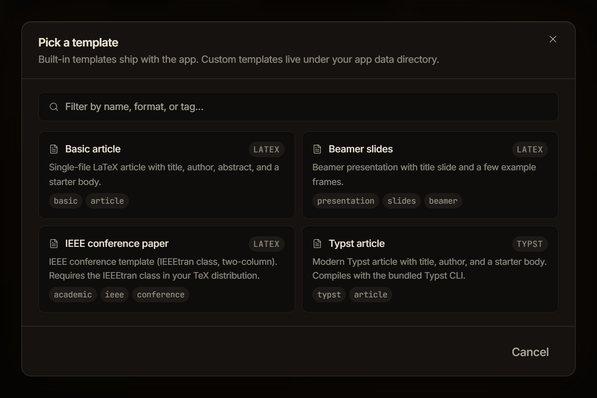

This guide shows you how to start a project from a template and how to save a project of your own as a template you can reuse.

A template gives a new project real structure from the first compile (a document class, a title block, starter content) instead of a bare starter file.

## Choose a built-in template

Four templates ship with the app: three LaTeX and one Typst.

| Template | Format | What you get |
| --- | --- | --- |
| **Basic article** | LaTeX | A single-file `article` with title, author, abstract, and a starter body. |
| **Beamer slides** | LaTeX | A Beamer presentation with a title slide and a few example frames. |
| **IEEE conference paper** | LaTeX | The two-column IEEEtran layout: `main.tex` plus a starter `references.bib`. |
| **Typst article** | Typst | A single-file Typst article with title, author, and a starter body in `main.typ`. |

**IEEE conference paper** needs the `IEEEtran` class in your TeX distribution. See [Choosing a compile engine](/getting-started/compile-engines/).

Typst is not bundled with Typeward. **Typst article** compiles only when the `typst` command-line tool is installed and on your `PATH`. See [Typst projects](/getting-started/typst/).

## Create a project from a template

1. Press `Ctrl+N` (`Cmd+N` on macOS), or select **New project** in the [projects library](/projects/library/), to open the **New project** dialog.
2. In the **Or start from:** strip, select **Template**.
3. In the **Pick a template** dialog, select a card. Cards are ordered by name, and each one carries the template's name, a format chip, a short description, and its tags.
4. On the second step, fill in **Project name** and the template's variable fields.
5. Select **Create**. The button reads **Creating…** while Typeward writes the project.



The dialog's own line reads "Built-in templates ship with the app. Custom templates live under your app data directory." The **Filter by name, format, or tag…** field narrows the grid as you type, matching name, description, format, and tags together. With nothing left the grid reads **No matching templates.**

## Fill in the variables

The second step is titled **New project from** plus the template you picked. Its line reads "Fill in the variables. They substitute into the starter files at create time." **Project name** starts as the template's name, and each template variable gets its own field.

| Template | Fields |
| --- | --- |
| **Basic article** | **Title**, **Author**, **Abstract** |
| **Beamer slides** | **Title**, **Author**, **Institute** |
| **IEEE conference paper** | **Paper title**, **Authors (comma-separated)**, **Abstract**, **Index terms** |
| **Typst article** | **Title**, **Author** |

Abstract fields are text areas. Every other field is a single line, and pressing `Enter` in any of them submits the form. **Back** returns to the grid.

Four rules govern what those fields do:

- **Defaults prefill.** Where the template carries a default, the field starts filled. **Title** and **Paper title** both start as `Untitled`.
- **The author field prefills from your profile.** A variable named `author` with no default in the template takes the display name from **Settings → Profile → Display name**. That covers **Basic article**, **Beamer slides**, and **Typst article**. The IEEE template's variable is named `authors`, so it starts empty.
- **Blank fields are fine.** An empty field substitutes as empty text. Creation never fails because you skipped the abstract, and you can fill it in later in the source.
- **Substitution happens once, at creation.** Files the template marks as templated carry `{{variable}}` placeholders that Typeward replaces with what you typed. Everything else in the template folder is copied byte for byte, which is why the IEEE template's `references.bib` arrives untouched.

In all four built-in templates the root file (`main.tex` or `main.typ`) is the templated one. Prefilled or not, every field stays editable. Once the project exists it is ordinary LaTeX or Typst, with no link back to the template.

## Save a project as a template

Any project you have open can become a template of your own. The **Save project as template** dialog describes the capture as "Capture the current project's files as a reusable custom template. Build output and .typeward/.git metadata are excluded."

The command palette is the only way in. The command carries no keyboard shortcut and no menu entry, and it is listed only while a project is open.

1. Open the project you want to capture.
2. Press `Ctrl+K` (`Cmd+K` on macOS) to open the command palette.
3. Run **Save project as template** to open its dialog.
4. Edit **Name**, which starts as the project name.
5. Optional: Fill in **Description (optional)**, which carries the placeholder "What this template is for."
6. Select **Save template**.

The dialog reports `Saved "<name>". It now appears under Custom in the template gallery.` and the remaining button becomes **Done**. An empty name gives `Give the template a name.` instead, and a name already taken gives `A custom template with this name already exists. Pick a different name.`

### Check what the capture includes

Saving copies the project's files as they sit on disk, and skips:

- the `.typeward/`, `.git/`, `.svn/`, `.hg/`, and `node_modules/` folders
- symbolic links
- LaTeX auxiliary files: `.aux`, `.log`, `.out`, `.toc`, `.lof`, `.lot`, `.fls`, `.fdb_latexmk`, `.bbl`, `.blg`, `.bcf`, `.nav`, `.snm`, `.vrb`, and any file with `.synctex` in its name

:::caution[A compiled PDF is captured too]
`main.pdf` is not on that skip list, so it is copied into the template along with your sources. Delete it from the saved template folder unless you want every new project starting with a stale PDF.
:::

A saved template has no variables. The capture records concrete file contents rather than placeholders, so the gallery's second step shows only **Project name** for it and the files are copied through unchanged.

### Find your custom templates on disk

Custom templates live under `templates/custom/` in Typeward's app data folder, one folder per template, each holding the captured files plus a `template.json` manifest. The folder name comes from the template name under the same sanitizing rule as project folders. See [Data locations](/reference/data-locations/).

The gallery has no delete button. Remove a custom template by deleting its folder.

### Add variables to a saved template

Edit `template.json` by hand to turn a captured project into a real template:

```json
{
  "id": "my-thesis-template",
  "name": "My thesis template",
  "description": "Department layout, with the front matter already set up.",
  "format": "latex",
  "tags": ["thesis"],
  "rootFile": "main.tex",
  "variables": [
    { "key": "title", "label": "Title", "default": "Untitled" },
    { "key": "author", "label": "Author", "default": "" },
    { "key": "abstract", "label": "Abstract", "default": "", "multiline": true }
  ],
  "files": [{ "path": "main.tex", "template": true }]
}
```

- Each entry in `variables` becomes a field in the gallery's second step, labeled with its `label` and prefilled with its `default`. Set `"multiline": true` for a text area.
- A file listed in `files` with `"template": true` gets `{{key}}` substitution at creation time. A placeholder whose key you never declared resolves to empty text.
- Files you do not list are copied verbatim, so a `.cls` file, a figure, or a `.bib` file is never at risk of accidental expansion.
- Typeward re-reads the folder every time the gallery opens, so a hand-edited manifest shows up the next time you open **Pick a template**.

## Check that it worked

Typeward writes the new project into your projects root and opens it in the editor. The folder name is derived from the project name: letters, digits, hyphens, and underscores survive, and every other character becomes a hyphen. A project named `My thesis` gets the folder `My-thesis`, and the projects library shows the name you typed.

A template you saved appears in the grid the next time you open **Pick a template**, sorted by name among the built-in ones. Despite what the save dialog's message says, there is no **Custom** section, and nothing on the card marks a template as yours.

## If it does not work

1. Rename the project when creation stops with an error. Typeward refuses to create the project if the derived folder already exists in your projects root.
2. Check `template.json` for a JSON error when a custom template stops appearing in the gallery. Typeward skips a manifest it cannot parse, without a warning.

## Next steps

- [Your first project](/getting-started/first-project/) walks through the editor and your first compile.
- [Typst projects](/getting-started/typst/) covers what a Typst project needs before it compiles.
