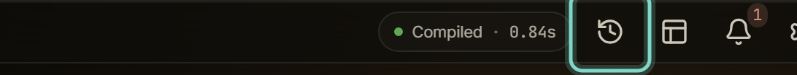
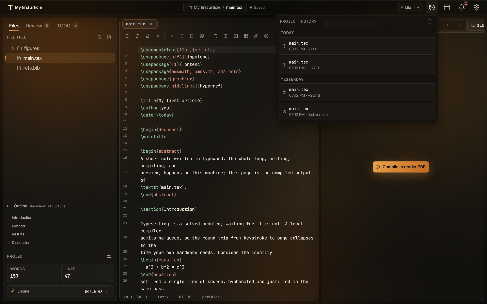

import Clip from '../../../components/Clip.astro';

This guide shows you how to compare an earlier version of a file against its current state and restore it. For edits you never saved, see [Autosave and crash recovery](/projects/autosave-recovery/).

Save the file at least once first, because Typeward records a version only after a successful save. Any save counts: `Ctrl+S` (`Cmd+S` on macOS), the **Save and compile** command, autosave, and the save a compile performs for you.

## Open the Project history panel

Open the panel by any of three routes:

- Select the **Project history** button in the top bar.
- Run **Project history** from the command palette, opened with `Ctrl+K` (`Cmd+K` on macOS).
- Run **Project history** from the [Editor context menu](/editor/context-menu/).

The panel is project-wide: it lists every recorded version of every tracked file, newest first, grouped by day. Each row shows the file path, the time of the version, and how its size changed against the version it replaced, or "first version" for the oldest one on record. Hovering a row shows how long ago the version was recorded, or the full date once it is more than a day old, along with the recorded size.

Before Typeward records anything, the panel reads "No versions yet. Typeward records one automatically on save, at most one per file every five minutes."

## Restore an earlier version

Restoring is non-destructive: Typeward records the state you replace before it writes anything.

1. In the panel, select the version you want back. The **Restore this version?** dialog opens with a read-only diff of that version against the file's current state.
2. Read the diff, then select **Restore this version**.

The diff compares against the open buffer when the file has a tab, and against the file on disk otherwise.

<Clip
  name="version-history"
  label="The Project history button opening the popover, and picking a version to show its diff against the current file"
/>

When you confirm, Typeward saves the open buffer first if it holds unsaved changes. It then records the file's current state as a new version, always, even inside the five-minute window. Only then does it write the selected version to disk and into the open buffer.

Typeward captures that safety record for files up to 64 MiB, so a restore never drops the current state of a file. If the record cannot be captured, for example because the file is not valid UTF-8, the restore aborts with an error and overwrites nothing. Restoring a file you deleted recreates it.

The rest of the app treats a restore as an ordinary save. In a project that uses [Cloud sync with WebDAV](/projects/cloud-sync/), Typeward pushes the restored file like any other save.

## Check that it worked

A **Version restored** toast names the file and the time of the version you restored. The panel now carries the state you replaced as the newest version of that file, so you can reverse a restore you regret by restoring again.

## If it does not work

If the version you expected is missing from the panel, work through these checks in order.

1. Check the file's extension. Typeward versions `.tex`, `.typ`, `.bib`, `.md`, `.txt`, and the support files `.cls`, `.sty`, `.bst`, `.def`, `.ldf`, `.fd`, `.clo`, `.cnf`. It never versions binaries such as figures and PDFs, or anything inside the project's `.typeward` folder.
2. Check that the save changed something. Saving a file whose content has not changed records nothing.
3. Check the clock. Typeward records at most one version per file every five minutes and skips the saves inside that window, so the next save after the window records again.
4. Check the file's size. Ordinary saves skip files over 2 MiB.
5. Check that the edits reached disk. See [Autosave and crash recovery](/projects/autosave-recovery/).

A save always completes even when Typeward cannot record a version for it.

## Choose how many versions to keep

Typeward keeps 50 versions per file by default and drops a file's oldest versions once it passes the limit.

1. Open **Settings → Editor**.
2. In the **File history** card, set **Versions kept per file**. The slider runs from 10 to 200, in steps of 5.

That card title is the one place the app still says **File history**. Every surface that opens the feature reads **Project history**. See [Settings reference](/reference/settings/).

## Clear a project's history

1. In the panel header, select the trash button, labeled **Clear project history…**.
2. In the **Clear project history** dialog, select **Clear all history**.

Typeward then deletes every recorded version for the project. Your files on disk are untouched, and only the recorded versions go.

## Find your history on disk

Typeward stores versions compressed, per project, in its app data folder, never inside the project folder.

- Windows: `%APPDATA%\com.typeward.app\history\`
- macOS: `~/Library/Application Support/com.typeward.app/history/`
- Linux: `~/.local/share/com.typeward.app/history/`

Each project gets a subfolder keyed to its root path. Typeward stores each version as a gzip-compressed blob named after the SHA-256 of its contents, and one `index.json` maps files to their ordered versions. Typeward stores identical content once, however many versions share it. [Data locations, credentials, and uninstall](/reference/data-locations/) lists this folder alongside everything else Typeward writes.

That location has four consequences:

- History stays on your machine. There is no account and no server to send it to, and history never appears in a project export, in your project folder, or in your commits.
- History is per machine. Copying a project folder to another computer does not carry its history along.
- History survives the project folder. If you delete or clobber the folder, the recorded versions are still in app data, which is the scenario history exists for.
- History is keyed to the project folder's path. Renaming a project inside Typeward keeps its history, but moving or renaming the folder outside the app starts a fresh history at the new location.

## Use history alongside git

Version history is independent of git and works whether or not a project is a repository. It lives outside the project folder, so it never appears in `git status` and needs no ignore rules. It never reads or writes git state, and git sees a restore as an ordinary file edit.

The two are complementary: [Git in Typeward](/projects/git/) gives you intentional, whole-project, message-carrying checkpoints, and version history gives you automatic, per-file protection between them.

## See also

- [Autosave and crash recovery](/projects/autosave-recovery/)
- [Git in Typeward](/projects/git/)
- [Settings reference](/reference/settings/)
- [Data locations, credentials, and uninstall](/reference/data-locations/)
