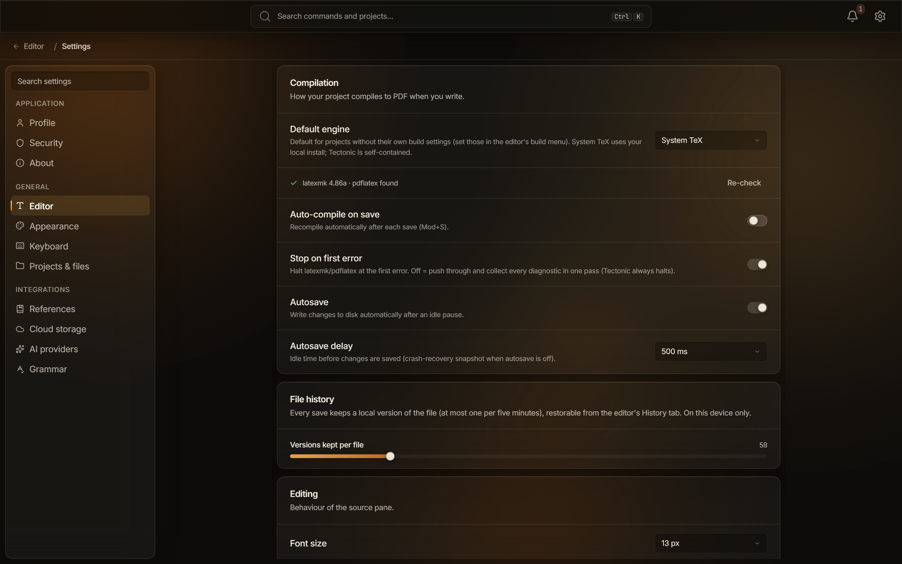

This page lists every section of Typeward's **Settings**, in the app's own order, with each control's exact label and default. Open **Settings** with `Ctrl+,` (`Cmd+,` on macOS), the gear in the top bar, or **Open Settings** in the command palette. It opens on **Appearance** unless a deep link sends you elsewhere, as the sync badge does for **Cloud storage**. The section list has a filter box, placeholder **Search settings**, that matches section names and a per-section keyword list. Typing `vim` finds **Editor**, typing `webdav` finds **Cloud storage**, and `Escape` clears the box.

## Application

### Profile

The card subtitle reads "Stored on this machine. Nothing here is sent anywhere."

| Setting | Default | What it does |
| --- | --- | --- |
| **Picture** | None | **Change picture** opens a file dialog titled "Choose a profile picture". PNG, JPEG, WebP, or GIF up to 8 MB. **Remove** appears once a picture is set. |
| **Display name** | Empty | Your name, used for authorship. |
| **Email** | Empty | Placeholder "e.g. you@example.com". |
| **Affiliation** | Empty | Placeholder "e.g. Department of Physics". |

Typeward copies the image into its app data folder, so moving or renaming the original does not break it. Only one avatar file is kept, so switching formats deletes the previous one. A file over 8 MB is refused with "image is too large (max 8 MB)".

With no picture set, the circle shows up to two initials from your display name. It falls back to the local part of your email when the name is empty, and to a generic icon when both fields are empty.

A footnote in the card is exact: "The name and email pre-fill the author of new projects. Git commits use the identity from your git config." Typeward never writes these values into a commit. See [Git in Typeward](/projects/git/).

### Security

**Security** holds one card, **Danger zone**, with one action.

**Reset local app data** carries the hint "Restores default settings and clears local UI state. Your project files on disk are untouched; the app reloads afterwards." The **Reset** button asks first, in a dialog titled "Reset local app data" whose buttons are **Reset and reload** and **Cancel**. The dialog reads "Reset Typeward to its defaults? Settings, theme preferences, and local UI state are cleared; project files on disk are untouched. The app reloads afterwards."

Confirming resets `settings.json` to defaults, clears the app's local UI state, deletes the stored profile picture, and reloads the window. Projects, files, version history, and keyring credentials stay as they are.

There are no crash-report, telemetry, analytics, or feedback settings in this section or anywhere else in the app. See [Privacy and network](/reference/privacy-and-network/).

### About

The **About Typeward** card carries the subtitle "The installed build and how updates are handled."

| Setting | Default | What it does |
| --- | --- | --- |
| **Version** | Read-only | The version of the build you are running. |
| **Check for updates** | Read-only | **Check now** looks for a newer release immediately. The hint is exact: "Look for a newer release right now. This is a plain HTTPS request to GitHub; no identifiers are sent." The button reads "Checking…" while it runs. |
| **Check automatically** | On | "Shortly after launch, look for a newer release and prompt you to install it. The check is a plain HTTPS GET to GitHub with no identifiers, and updates never install without your confirmation." Once builds are signed, that check will run about ten seconds after launch. |

This build ships without an update signing key, so the updater is dormant. The automatic check does nothing, and **Check now** answers with a toast: "Updates aren't configured yet. This build predates automatic updates. Grab new versions from the Typeward download page." You install new versions by hand from the [Typeward releases page](https://github.com/typeward/releases/releases). See [Updates](/reference/updates/).

## General

### Editor

**Editor** holds four cards: **Compilation**, **File history**, **Editing**, and **PDF preview**.

#### Compilation

The card subtitle reads "How your project compiles to PDF when you write."

| Setting | Default | What it does |
| --- | --- | --- |
| **Default engine** | **System TeX** | **System TeX** or **Tectonic**. The hint reads "Default for projects without their own build settings (set those in the editor's build menu). System TeX uses your local install; Tectonic is self-contained." First-run onboarding picks **Tectonic** when it finds no TeX installation. |
| **Auto-compile on save** | Off | Recompiles automatically after each save, including saves made by autosave. A LaTeX project with its own build settings overrides this, and Typst projects always follow the global setting. |
| **Stop on first error** | On | "Halt latexmk/pdflatex at the first error. Off = push through and collect every diagnostic in one pass (Tectonic always halts)." On passes `-halt-on-error`. |
| **Autosave** | On | "Write changes to disk automatically after an idle pause." |
| **Autosave delay** | 500 ms | 300, 500, 1000, or 2000 ms. "Idle time before changes are saved (crash-recovery snapshot when autosave is off)." A hand-edited value between 200 and 5000 ms is accepted on load even though the menu does not offer it. |

The **Default engine** row carries a live status line reporting what the probe found for the engine you have selected, and a **Re-check** button runs the probe again. Every line it can show, and what each one means, is listed in [The engine status line in Settings](/getting-started/compile-engines/#the-engine-status-line-in-settings).

See [Choosing a compile engine](/getting-started/compile-engines/), [Build configuration](/compiling/build-configuration/), [Compiling LaTeX](/compiling/compiling-latex/), and [Autosave and crash recovery](/projects/autosave-recovery/).

#### File history

The card subtitle reads "Every save keeps a local version of the file (at most one per five minutes), restorable from the editor's History tab. On this device only."

| Setting | Default | What it does |
| --- | --- | --- |
| **Versions kept per file** | 50 | A slider from 10 to 200 in steps of 5. The bounds are enforced on load as well, so a hand-edited value outside them is clamped. |

See [Version history](/projects/version-history/).

#### Editing

The card subtitle reads "Behaviour of the source pane." The app uses the British spelling there.

| Setting | Default | What it does |
| --- | --- | --- |
| **Font size** | 13 px | 10, 11, 12, 13, 14, 15, 16, 18, or 20 px. |
| **Soft wrap long lines** | On | Wraps at the pane edge instead of scrolling sideways. |
| **Line height** | **Normal** | **Compact**, **Normal**, or **Relaxed**. |
| **Tab size** | 2 | "Indent width in spaces." 2, 4, or 8. |
| **Line numbers** | On | Shows the line-number gutter. |
| **Highlight active line** | On | Tints the line the cursor is on. |
| **Autocomplete** | On | "Built-in word/snippet completion. Language-server completion is unaffected." |
| **Bracket matching** | On | "Highlight the matching bracket at the cursor." |
| **Auto-close brackets** | On | "Insert the closing bracket/quote automatically." |
| **Keybindings** | **None** | **None**, **Vim**, or **Emacs**: "Vim or Emacs editing bindings for the source pane. None keeps the standard bindings." |
| **Visual editing for LaTeX** | Off | Renders `.tex` files as a formatted document, with the markup hidden. One preference for every `.tex` file: `Ctrl+Shift+V` (`Cmd+Shift+V` on macOS) and the **Source** / **Visual** control in the format toolbar write this same setting. The shortcut is available only while the active file is `.tex`. |
| **Spell & grammar check** | Off | The same switch as **Harper** under **Grammar**. The hint says "Powered by Harper. Configure it under Settings → Integrations → Grammar." |

See [Autocomplete and snippets](/editor/autocomplete-and-snippets/), [Focus mode and Vim](/editor/focus-and-vim/), [Visual editing](/editor/visual-editing/), and [Grammar checking](/editor/grammar-checking/).

#### PDF preview

The card subtitle reads "How the compiled output is displayed."

| Setting | Default | What it does |
| --- | --- | --- |
| **Default zoom** | 110% | "Zoom level the preview opens at." 80, 90, 100, 110, 125, or 150%. |
| **Invert on dark themes** | Off | "Flip the white page to dark for night reading (only while a dark theme is active)." |

See [PDF preview](/preview/pdf-preview/).

### Appearance

**Appearance** holds four cards: **Theme**, **Accent**, **Custom themes**, and **Density & motion**. See [Themes](/editor/themes/).

#### Theme

The card subtitle reads "Built-in themes. Disabled while a custom theme is active."

| Setting | Default | What it does |
| --- | --- | --- |
| **Theme** | **Daylight** | Two groups of tiles. **Basic** holds **Light** and **Dark**; **Styled** holds **System**, **Daylight**, **Lamplight**, **Aurora**, and **Paper**. **System** follows the operating system appearance live, resolving to **Daylight** while the OS is light and **Lamplight** while it is dark. Arrow keys, `Home`, and `End` move between tiles. |

While a custom theme is active, this card dims and reads "Managed by your custom theme. Turn it off in Custom themes below to change these."

#### Accent

The card subtitle reads "The signature gradient on buttons, active items, and highlights."

| Setting | Default | What it does |
| --- | --- | --- |
| **Accent** | **Theme default** | **Theme default** (each theme's own accent), **Ember**, **Tide**, or **Orchid**. |
| **Gradient** | On | "Blend both accent stops across buttons, active items, and highlights. Off uses the solid accent color." |
| **Glow** | On | "Soft accent glow behind primary buttons and card hovers." This row appears only while a Styled theme is active, since **Light** and **Dark** have no glow. |

#### Custom themes

The card subtitle reads "JSON theme files layered over a built-in base. Edit a file, hit Reload, and the app re-skins live. See the sample for the full token vocabulary."

| Setting | Default | What it does |
| --- | --- | --- |
| **Enable custom themes** | Off | "While a custom theme is active the built-in theme and accent pickers above are bypassed." |
| **Theme files** | None | "One .json per theme in the app's themes folder. The file name becomes the theme id." The buttons are **Open folder**, **Create sample**, and **Reload**. Selecting a theme tile activates it, and selecting the active tile deactivates it. Reloading is manual: nothing watches the folder. |

The themes folder sits beside `settings.json` in the app data folder. The token vocabulary, the size limits, and how to write a theme file are on [Themes](/editor/themes/).

#### Density & motion

Four rows set spacing, scale, and motion.

| Setting | Default | What it does |
| --- | --- | --- |
| **UI density** | **Cozy** | **Compact**, **Cozy**, or **Comfortable**: "Affects padding and row heights across the app." On a touch device with no previous choice, the first launch switches to **Comfortable** and remembers that it did. |
| **Interface scale** | 100% | 90 to 150% in steps of 5. The hint is exact: "Scales text and controls together. Cmd/Ctrl + and − adjust it from anywhere; Cmd/Ctrl 0 resets." |
| **Animations** | On | "Toggles transitions, easings, and ambient motion across the app." With Reduce Motion enabled in the operating system, the hint changes to "Your system's Reduce Motion setting is on, so animations stay off regardless of this toggle." |
| **Ambient lights** | On | "Soft radial blobs behind the glass surfaces. Disable for a flat, distraction-free backdrop." Like **Glow**, this row appears only while a Styled theme is active. |

The **Interface scale** slider is the app's zoom. `Ctrl+=` (`Cmd+=` on macOS) zooms in, `Ctrl+-` zooms out, and `Ctrl+0` resets it to 100%. Typeward has no separate window zoom.

### Keyboard

**Keyboard** holds no settings. The panel is a live, read-only list of every registered command that has a shortcut, sorted by command name. Its subtitle states the limitation exactly: "Bindings come from the command registry; format-specific commands appear while a matching project is open. Remapping isn't supported yet."

Format-specific commands appear only while a matching project is open, so a LaTeX project adds rows a Typst project does not, and the reverse. The panel also carries one hard-coded row, **Jump to source**: "Double-click (or Shift+click) anywhere on the PDF preview to jump the editor to that line."

Shortcut chips render `Ctrl` on Windows and Linux and `⌘` on macOS. See [Keyboard shortcuts](/reference/keyboard-shortcuts/) for the full list, including editor bindings that are not registered commands.

### Projects & files

**Projects & files** holds two cards: **Storage** and **Projects screen**.

#### Storage

One row sets where Typeward creates new projects.

| Setting | Default | What it does |
| --- | --- | --- |
| **Projects folder** | `Documents/Typeward` | "New projects are created here. Existing projects stay where they are." **Change…** opens a directory picker titled "Choose the projects folder". The new location must be an absolute path inside your Documents folder, and anything else is refused with "projects root must be an absolute path under Documents". |

See [Data locations](/reference/data-locations/).

#### Projects screen

Four toggles change what the [projects library](/projects/library/) shows.

| Setting | Default | What it does |
| --- | --- | --- |
| **Enable Spaces** | On | "Show the Spaces grouping in the projects sidebar." |
| **Enable Tags** | On | "Show the Tags list in the projects sidebar." |
| **Notifications panel default** | Off | "Show the right-side notifications drawer on every projects-screen visit." |
| **Word count on project cards** | Off | "Show an approximate word count on each card. Reads each project's root file when the library loads." |

## Integrations

Every integration is off or unconfigured out of the box, and every one uses credentials you supply. Those credentials live in the operating system keyring rather than in `settings.json`. Provider rows carry an uppercase status chip: **Ready**, **Not configured**, **Not reachable**, **Checking…**, or **Error**.

### References

The card subtitle reads "Connect a reference manager to autocomplete \cite{…} keys and append the aggregated library to the project's .bib."

| Setting | Default | What it does |
| --- | --- | --- |
| **Zotero (local)** | Off | Reads your libraries from the Zotero app on the same machine, with no login. The switch stays disabled until the local probe succeeds, and a **Re-check** button appears while Zotero is unreachable. The hint reads "Talks to the Zotero app on this machine; no login needed. Works with plain Zotero 7 (enable 'Allow other applications…' under Settings → Advanced); the Better BibTeX plugin is optional and adds nicer citation keys. Your libraries (personal + groups) are discovered automatically." |
| **Zotero Web API** | Not configured | Needs a numeric **User id** (placeholder "e.g. 1234567") and a read-only **API key** created on [Zotero's API keys page](https://zotero.org/settings/keys), which the **Get key** link opens in your browser. **Connect** validates the key against Zotero's API before storing it in the keyring, and deletes it again if Zotero rejects it. Once connected, the row reads "Connected as user {id}." and offers **Disconnect**. |
| **Mendeley** | Not configured | Kept for migration only. The row says so itself: "Mendeley Desktop was discontinued in 2022 and the API is in maintenance mode. Use Zotero for new workflows; this exists for migration." It needs a **Redirect URL** (default `http://localhost:5000/callback`) that matches an app registered at `dev.mendeley.com` character for character. A **Client secret** goes to the keyring, and **Sign in** completes the OAuth round trip. |

See [How references work](/references/how-references-work/) and [Connecting reference managers](/references/connecting-reference-managers/).

### Cloud storage

The card subtitle reads "Open a project from a WebDAV server. Files stay local-first; the engine polls for remote changes and pushes on autosave."

**Cloud storage** offers one provider, **WebDAV**, and its hint names the servers it is tested against: "Self-hosted or hosted WebDAV: Nextcloud, ownCloud, Fastmail, mailbox.org, a NAS. Use an app password (not your account password); it's required when 2FA is on. Files sync through a local cache, so edits work offline and conflicts surface as `.conflict-*` files."

**Add server** opens three fields and a checkbox.

| Setting | Default | What it does |
| --- | --- | --- |
| **Server URL** | Empty | Placeholder "e.g. https://cloud.example.com/remote.php/dav/files/you/". A bare host gets `https://` and a trailing slash added for you. HTTPS is required, including on a local network. |
| **Username** | Empty | Your account name on the server. |
| **App password** | Empty | An app password, not your login password. Required when the server has two-factor authentication. |
| **Allow a private / LAN server (10.x, 172.16.x, 192.168.x). Loopback and cloud-metadata addresses stay blocked.** | Off | Permits private-range addresses for this account only. |

**Connect** ("Connecting…" while it works) screens the host, writes the password to the keyring, and verifies the credentials before the account is saved. A failed check answers with "WebDAV sign-in failed. Check the username and app password." Typeward then deletes the password again. Missing fields raise "Server URL, username, and app password are all required."

You can add more than one account, and each is listed with a **Disconnect** button. Disconnecting removes the credential, and any project bound to that account keeps working as a plain local folder. See [Cloud sync](/projects/cloud-sync/).

### AI providers

The nav item is **AI providers**, and the card inside it is titled **AI**. The card subtitle reads "Optional assistant chat in the editor, routed through the provider you pick. Turn it off to hide every AI surface: no provider runs, nothing leaves the machine."

| Setting | Default | What it does |
| --- | --- | --- |
| **AI assistant** | Off | "Master switch. Off removes the chat panel and its toolbar button from the editor and deactivates the provider below." Provider rows appear only while it is on. |

With the master switch on, one provider row appears: **Ollama (local)**, which needs no key and no account. Its hint reads "Local models via the Ollama app. Auto-detected, nothing to configure: install from ollama.com, pull a model, and it shows up here."

While the daemon is running, the row reads "Detected", then " · " and the number of models, with the first few names and a refresh button. **Use this** makes it the active provider, after which the button reads **Active**.

While it is not running, the row reads "Ollama isn't running. Install it from ollama.com, pull a model (e.g. ollama pull gemma3), and it's detected automatically; no setup needed." That state also carries a **Custom URL (optional)** field (placeholder "e.g. `http://localhost:11434`") and a **Re-check** button. The URL must stay on the loopback address, so a remote Ollama is refused.

**Settings** offers no cloud providers. The code that talks to them still ships, so a provider configured by an older build keeps answering, but it cannot be set up or changed here. See [AI assistant](/ai/overview/) for what the assistant sends, and when.

### Grammar

The card subtitle reads "Local Harper grammar + spell check. Runs in-process via the Rust crate: zero network, all on-device. LaTeX commands and Typst code are skipped automatically; diagnostics surface as squiggles with one-click fixes."

| Setting | Default | What it does |
| --- | --- | --- |
| **Harper** | Off | "Rust-native English grammar engine. Underlines spelling, grammar, and style issues with quick-fix suggestions." This is the same switch as **Spell & grammar check** in **Editor**, so flipping either flips both. |
| **English dialect** | **American (en-US)** | **American (en-US)**, **British (en-GB)**, **Canadian (en-CA)**, **Australian (en-AU)**, or **Indian (en-IN)**. |
| **Personal dictionary** | 0 words | Shown as "Personal dictionary: N words", with "Words you added via \"Add to dictionary\" are never flagged." **Manage** lists the words and lets you remove them one at a time, and **Done** closes the list. |
| **Ignored suggestions** | None | "Restore every lint you dismissed with \"Ignore\"." **Reset ignored lints** brings them all back and confirms with an "Ignored lints cleared" toast. |

The dictionary and the ignore list are plain files in the app data folder, beside `settings.json`. See [Grammar checking](/editor/grammar-checking/).

## How these values are stored

Everything in **Settings** is written to `settings.json` in Typeward's app data folder. Writes are debounced by 250 ms, and a failed write raises a **Couldn't save settings** toast. A hand-edited value outside the allowed range is clamped, or falls back to the default, the next time the app loads it, so a bad edit cannot wedge the app. See [Data locations](/reference/data-locations/) for the exact path.

Nothing here syncs. There is no account, no Typeward server, and no settings sync of any kind, so every value belongs to the machine you set it on. Passwords, API keys, and OAuth tokens never reach `settings.json`, because they go to the operating system keyring (Windows Credential Manager, Apple Keychain, or the Secret Service on Linux).

The one thing that moves between machines is project files, and only if you connect a WebDAV server yourself. See [Cloud sync](/projects/cloud-sync/).

### Values set outside Settings

Some preferences are set where you use them and never appear in **Settings**, though they land in the same `settings.json`:

- The projects library view mode and sort order
- The dashboard cards, their arrangement, and your Spaces
- The editor's split layout, logs panel position, and sidebar width
- The active AI provider and its per-provider model
- The templates you used recently

**Reset local app data** clears these along with everything else.

:::note
On a narrow window, **Settings** shows one level at a time: the section list first, then the panel behind a back header, with `Escape` stepping back out.
:::

## See also

- [Data locations](/reference/data-locations/)
- [Keyboard shortcuts](/reference/keyboard-shortcuts/)
- [Privacy and network](/reference/privacy-and-network/)
- [Themes](/editor/themes/)
